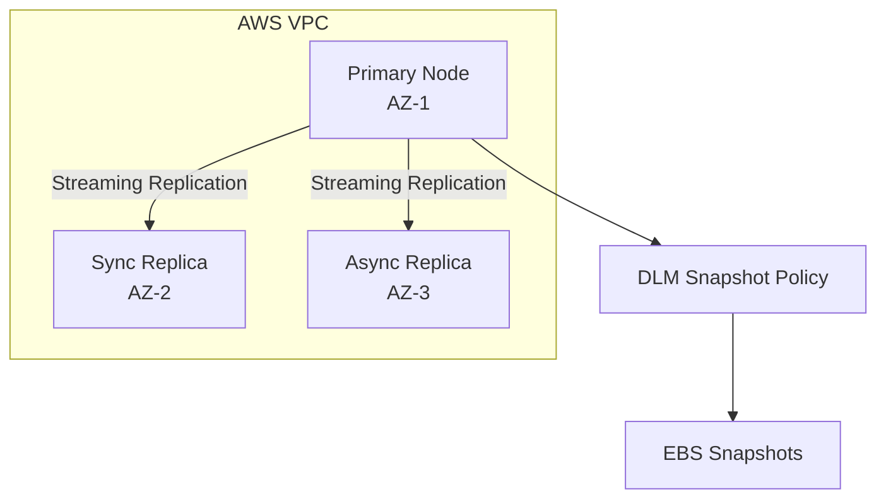

# Multi-AZ PostgreSQL High Availability Deployment on AWS

This project demonstrates a production-style highly available PostgreSQL architecture deployed on AWS using EC2 instances, EBS volumes, Docker containers, and automated disaster recovery through AWS Data Lifecycle Manager snapshots.

The goal of the project was to simulate a real production database environment without using managed services such as RDS.

---

## Architecture Overview

This deployment spans three Availability Zones to ensure high availability and resilience against infrastructure failures.

- **Primary Database Node**
- **Synchronous Replica (Zero Data Loss)**
- **Asynchronous Replica (Disaster Recovery / Read Scaling)**

Technologies used:

- AWS EC2
- AWS EBS (gp3 volumes)
- Docker
- PostgreSQL 16
- AWS Data Lifecycle Manager (DLM)

---

## Architecture Diagram



---

## Infrastructure

| Component | Configuration |
|-----------|--------------|
| Cloud Provider | AWS |
| Instances | 3 EC2 Instances |
| Instance Type | t3.medium |
| Storage | 23GB gp3 EBS volumes |
| Database | PostgreSQL 16 |
| Container Runtime | Docker |
| Replication | Streaming Replication |
| Backup | AWS Data Lifecycle Manager |

---

## Node Configuration

| Node | Availability Zone | Private IP | Role |
|-----|------------------|-----------|------|
| Node 1 | eu-north-1c | 172.31.12.103 | Primary |
| Node 2 | eu-north-1a | 172.31.37.41 | Synchronous Replica |
| Node 3 | eu-north-1b | 172.31.22.54 | Asynchronous Replica |

---

# Infrastructure Setup

## VPC and Networking

The database infrastructure was deployed inside a private VPC.

VPC CIDR:

```
10.0.0.0/16
```

Security rules:

Inbound

| Port | Purpose |
|-----|--------|
| 22 | SSH access |
| 5432 | PostgreSQL traffic |

Outbound

```
Allow All
```

This allows instances to download Docker images.

---

# Storage Configuration

Each database node uses a dedicated AWS EBS gp3 volume.

Volume configuration:

| Property | Value |
|--------|------|
| Type | gp3 |
| Size | 23GB |
| IOPS | 3000 |
| Throughput | 250 MB/s |

The gp3 volume was selected because it allows independent control of IOPS and throughput while remaining cost effective.

---

# EBS Volume Setup

After attaching the EBS volume to each instance, the disk was formatted and mounted.

Identify the disk:

```bash
lsblk
```

Format disk:

```bash
sudo mkfs -t xfs /dev/xvdf
```

Create mount point:

```bash
sudo mkdir -p /mnt/postgres_data
```

Mount disk:

```bash
sudo mount /dev/xvdf /mnt/postgres_data
```

Verify mount:

```bash
df -h
```

Make mount persistent:

```bash
sudo blkid
sudo nano /etc/fstab
```

Add:

```
UUID=<disk-uuid> /mnt/postgres_data xfs defaults,nofail 0 2
```

---

# Deploying PostgreSQL with Docker

PostgreSQL runs inside a Docker container with the data directory mapped to the EBS volume.

Start container:

```bash
docker-compose up -d
```

Verify container:

```bash
docker ps
```

---

# Replication Setup

Streaming replication was configured using a dedicated replication user.

Create replication role on primary node:

```bash
CREATE ROLE replicator WITH REPLICATION LOGIN PASSWORD 'password';
```

Replica nodes synchronize using `pg_basebackup`.

```bash
pg_basebackup \
-h 172.31.12.103 \
-D /mnt/postgres_data \
-U replicator \
-P \
-v \
--wal-method=stream
```

Enable standby mode:

```bash
touch /mnt/postgres_data/standby.signal
```

---

# Replication Verification

Check replication on primary node:

```bash
sudo docker exec -it postgres_cluster psql -U postgres \
-c "SELECT client_addr, state, sync_state FROM pg_stat_replication;"
```

Expected result:

```
172.31.37.41 | streaming | sync
172.31.22.54 | streaming | async
```

---

# Disaster Recovery

Snapshots are automated using AWS Data Lifecycle Manager.

Policy configuration:

| Setting | Value |
|-------|------|
| Frequency | Every 12 hours |
| Retention | 14 snapshots |
| Target | Tagged EBS volumes |

Snapshots ensure recovery if an entire availability zone fails.

---

# Snapshot Policy Screenshot


---

# Security Best Practices

Security controls implemented:

Encryption at rest

EBS volumes encrypted using AWS KMS.

Secure replication traffic

PostgreSQL configured to support SSL/TLS.

IAM best practices

Snapshots managed using an IAM role instead of static credentials.

---

# Failover Strategy

If the primary node fails:

1. Promote synchronous replica

```
pg_ctl promote
```

2. Redirect applications to new primary.

3. Rebuild failed node from snapshot.

---

# Lessons Learned

This project provided hands-on experience with:

- Designing high availability database architectures
- PostgreSQL streaming replication
- AWS EBS performance tuning
- Automated disaster recovery using snapshots

---

# Author

Kate Mwaura

DevOps / Cloud Engineering Student
